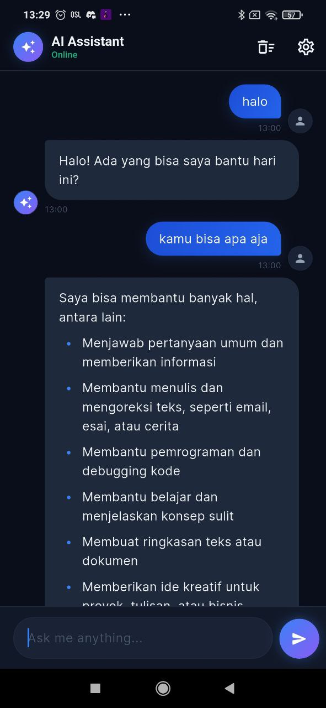
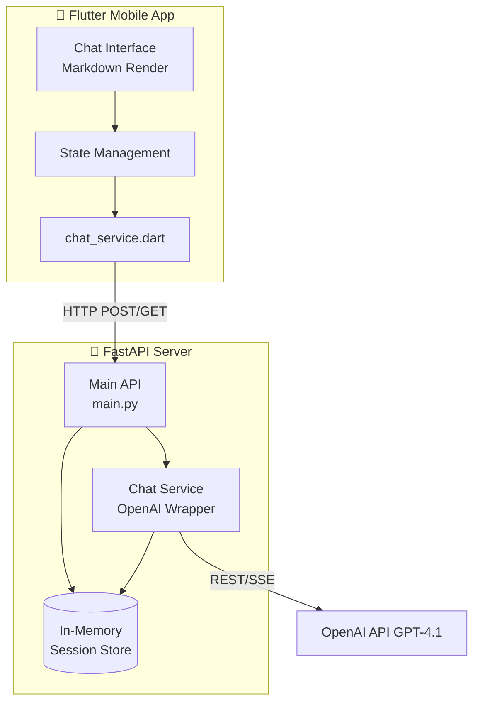

<h1 align="center">✨ AI Chatbot Assistant</h1>

<p align="center">
  <strong>A production-ready AI Chatbot mobile application built with Flutter & Python FastAPI.</strong><br>
  <em>Showcasing modern Fullstack AI Engineering practices, elegant UI/UX, and robust API integration.</em>
</p>

<p align="center">
  
  
  
  
</p>

---

## 📌 Overview

This project is a high-performance **AI Chatbot** application that mirrors the core functionality of ChatGPT. The frontend is a cross-platform mobile app structured with **Flutter**, featuring a premium dark-mode UI with smooth micro-animations. The backend is powered by **Python FastAPI**, handling session memory, API payload parsing, and direct integration with **OpenAI’s GPT-4.1-mini** (or other LLMs).

Designed as an **AI Engineering Portfolio piece**, it demonstrates clean architecture, separated concerns, efficient memory management, and responsive state handling.

## 📸 Interface Preview

<p align="center">
  
</p>

## ⚙️ Core Architecture



### 🔹 App Features (Frontend)
- **Fluid UI/UX**: Custom dark theme palette (navy & electric blue) with bouncy splash screens.
- **Dynamic Messaging**: Slide-in markdown-rendered AI bubbles vs gradient user bubbles.
- **Typing Indicators**: Staggered bounce animations while the AI computes an answer.
- **Dynamic Endpoint Settings**: Change backend server IP dynamically inside the app settings (useful for switching between Localhost & LAN IP).
- **Session Persistence**: Chat session UUIDs persist on the device using `shared_preferences`.

### 🔹 Backend Features (FastAPI)
- **High Concurrency**: Built with Python `asyncio` and async OpenAI bindings.
- **Context Window Management**: Sliding window memory (maintains only the last 10 messages) to prevent expensive token overload while maintaining conversation context.
- **System Provisioning**: Configurable `SYSTEM_PROMPT` to alter the AI's identity and behavior globally.

---

## 🚀 Getting Started

To run this project locally, you need to spin up both the **Backend API** and the **Flutter App**.

### 1️⃣ Setting up the Backend (FastAPI)

1. Navigate to the backend directory:
   ```bash
   cd backend
   ```
2. Create a virtual environment (optional but recommended):
   ```bash
   python -m venv venv
   source venv/Scripts/activate   # Windows
   # source venv/bin/activate     # Mac/Linux
   ```
3. Install dependencies:
   ```bash
   pip install -r requirements.txt
   ```
4. Setup your API Key:
   - Copy `.env.example` to `.env`
   - Paste your real OpenAI API Key into the `.env` file:
   ```env
   OPENAI_API_KEY=sk-your-openai-key-here
   LLM_MODEL=gpt-4.1-mini
   ```
5. Run the server:
   ```bash
   python -m uvicorn main:app --host 0.0.0.0 --port 8000 --reload
   ```
   *The server is now listening at `http://localhost:8000`. You can view the swagger UI at `http://localhost:8000/docs`.*

### 2️⃣ Setting up the Frontend (Flutter)

1. Open a **new terminal** and navigate to the root directory `contoh/` (where `pubspec.yaml` is).
2. Fetch Flutter packages:
   ```bash
   flutter pub get
   ```
3. Run the application:
   ```bash
   flutter run
   ```

### 💡 Connection Troubleshooting (Important)
Because the app runs inside an Emulator or physical phone, it cannot simply access the backend via `localhost`.

- **If using Android Emulator**: The backend URL inside the app is preset to `http://10.0.2.2:8000` (which is the emulator's alias for your PC's localhost). It will work automatically.
- **If using a Physical Phone**: 
  1. ensure your phone and PC are on the same Wi-Fi.
  2. Find your PC's IP address (e.g. `192.168.100.5`).
  3. Open the app, tap the **Settings (⚙️)** icon, and change the Backend URL to `http://192.168.100.5:8000`.

---

## 🛠 Tech Stack Details
* **Frontend**: Dart, Flutter (v3.41+), `http`, `flutter_markdown`, `shared_preferences`
* **Backend**: Python 3.10+, FastAPI, Uvicorn, Pydantic, Dotenv
* **AI Integration**: Official `openai` Python SDK (Async Client)

## 👤 Author 
**Surahma Jaya** - AI Engineer & Developer
*Building intelligent, real-world systems.*